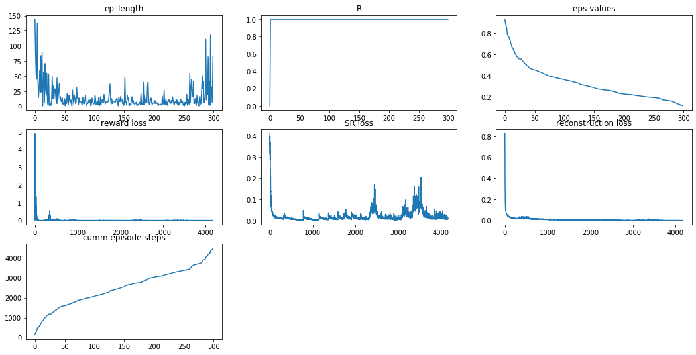
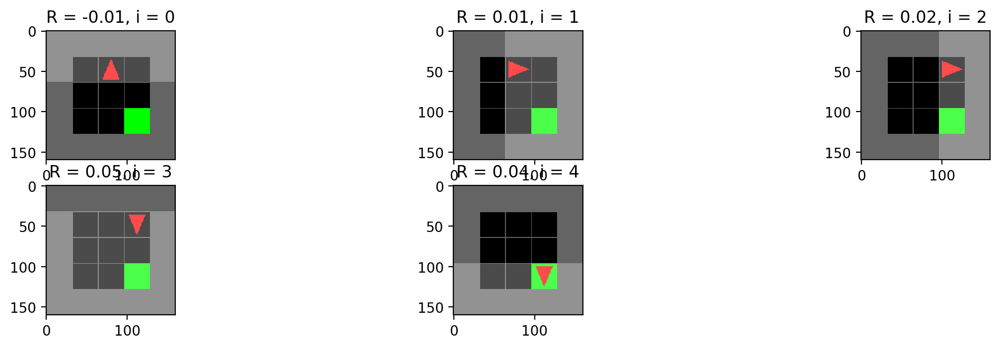
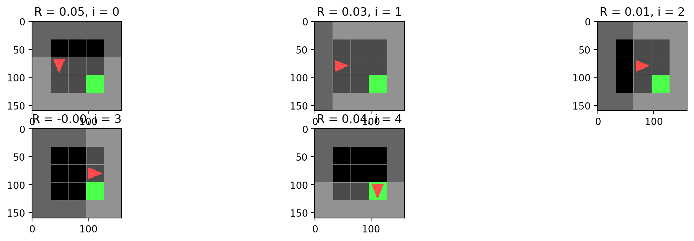
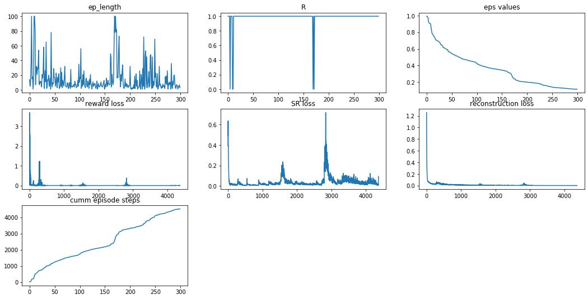

# PyTorch implementation of Deep Successor Reinforcement Learning (DSR) 

## Introduction

This is a pytorch implementation of the [Deep Successor Reinforcement Learning (DSR)](https://arxiv.org/abs/1606.02396) paper. The code from original authors written in lua is [here](https://github.com/Ardavans/DSR). I used this [DQN base code](https://pytorch.org/tutorials/intermediate/reinforcement_q_learning.html) and implementing ideas from the paper by changing it. I did not refer to the original lua code.

## How to run
`python3 train_agent.py --env <env_name>`

## Environments

The authors implemented the code for the game `MazeBase`, but because it was not available, I used [gym-minigrid](https://github.com/maximecb/gym-minigrid) instead. These are the exact environments on which the code has been tested: `MiniGrid-Empty-Random-5x5-v0` and `MiniGrid-Empty-Random-6x6-v0`.

## Tricks implemented

The authors used special tricks to get the network to learn, I made modifications to them while implementing them here.
* Author's size of experience replay buffer: `10^6`. (I use a smaller buffer size for faster training)
* Author's optimization technique: SGD with `lr=2.5e-4` and `momentum=0.95` (I use adam with the same parameters so that it learns faster)
* Author's discount factor: `0.99` (I used the same)
* Annealation of epislon: `1` to `0.1` in `2e4` steps. (I decay it more quickly for faster training)
* `For all experiments, we prioritize the reward training by keeping a database of non-zero rewards and sampling randomly from the replay buffer with a 0.8 probability and 0.2 from the database`. (I implemented this trick, this means that the code would fail if it's not in a sparse reward scenario)
* `For training the reward branch, we anneal the number of samples that we use, from 4000 to 1 by a factor of 0.5 after each training episode` (Implemented the trick)

## To do
These are the things that are yet to be implemented.
* Dropout while training for more robustness
* Check target net update frequency
* Generating the plots to visdom for live tracking
* Increase efficiency of sampling from memory
* Add requirements file (or conda environment in .yml) here

## Failed attempts
* Tried to run this algorithm on Atari, but they has their own issues. `Pong` has issues because we're resizing it to 80x80 and reconstructing the ball which is about 1-2 pixels is hard. Maybe I should use difference between frames and try again. `Boxing` takes too long for each episode (because each episode is 2 minutes in real-time), and runs out of memory when I run on GPU. Not sure why.

## Results

Training curve for a 4x4 grid.

Here are a few successful examples of the trained model on a 3x3 grid.

Here are some training curves for the same.

## Disclaimer

* We are working in a very limited state space in the `MiniGrid-Empty-Random-5x5-v0` and `MiniGrid-Empty-Random-6x6-v0` examples. This algorithm needs to be tested on more complicated environments to realize it's potential.
* Please report any bugs you find in the code as an issue. The code is not in usable state yet, use at your own risk.